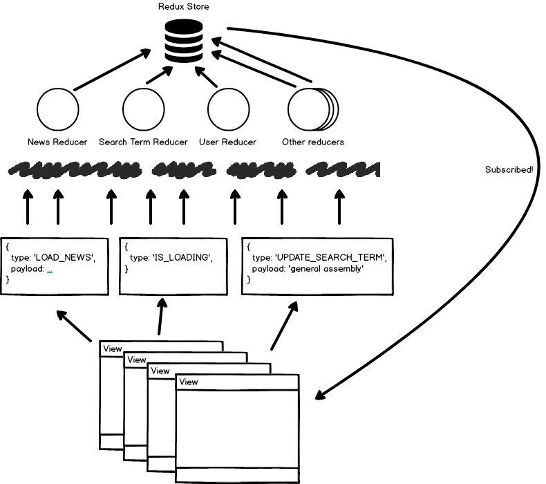
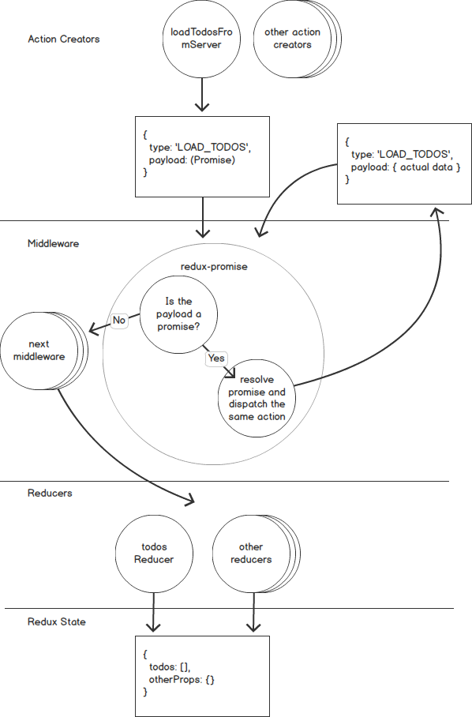

# Learning Redux

---

## Overview
1. Why Redux
2. Redux: single store, actions, reducers
3. Redux middleware for dev tooling
4. React-Redux library
5. Redux middleware for async actions
6. Selectors with Reselect library
7. Recommendations

---

## Managing state in React w/o Redux

--

### React `state`

* `state` is used as a data store for the app
```js
  constructor(props) {
    super(props);
    this.state = {
      todos: [],
      searchTerm: '',
    };
  }
```
* It is often spread across multiple components, each with their own `state`

--

### Upsides to `state`

* Low barrier to entry
* Doesn't require any additional libraries

--

### Downsides to `state`

* Can't be used to server-side render React components
* No single source of truth (multiple component `state`s)
* Requires `React.createClass` or extending `React.Component`
* Often leads to tight coupling of presentation and data model

Note:
* At scale, can be difficult to reason about

--

### Alternatives to `state`

* MobX https://github.com/mobxjs/mobx
* Redux http://redux.js.org/
* Reflux https://github.com/reflux/refluxjs
* Or any other one of the million flux libraries

--

### Why Redux

* Huge ecosystem of middleware
* Great dev tooling (e.g. time travel debugging)
* Great documentation http://redux.js.org/
* De facto choice for React state management
* Well supported by other libraries/frameworks
* Supports React server side rendering

---


## Actions, Reducers, <del>and Middleware</del>

(We'll talk about middleware later on)

--

### A single source of truth

One object. One store.

```js
  {
    isLoading: false,
    todos: [{}, {}, {}],
    searchTerm: 'vistaprint digital',
    bookmarks: [733, 522, 28],
    userProfile: {
      firstName: 'Eric',
      lastName: 'Masiello',
      email: 'eric.j.masiello@gmail.com',
      jwt: 'xxxxx.yyyyy.zzzzz',
    },
  }
``` 


\*"Ephemeral data" can still be stored in `state`

--

### Synchronous

* Redux only handles synchronous data flow
* Must apply middleware to work asynchronously (e.g. `redux-thunk`, `redux-promise`, `redux-promise-middleware`, `redux-saga`)

--

### Redux Data Flow



*Note:* This does not account for middleware

--

### Updating State with Actions

* Redux state is read only
* Changes are made via dispatched **actions**
* Actions have a `type` property

```js
store.dispatch({ type: 'IS_LOADING' });

store.dispatch({ type: 'DONE_LOADING' })

store.dispatch({ type: 'UPDATE_SEARCH_TERM', payload: 'vistap' })

```
*Think of actions as the "breadcrumbs" of what's changed*

[See Flux Standard Actions](https://github.com/acdlite/flux-standard-action)

--

### Action Creators

* A factory that returns an action
```js
  // searchTermActions.js
  function updateSearchTerm(searchTerm) {
    return {
      type: 'UPDATE_SEARCH_TERM',
      payload: searchTerm,
    };
  }

  // SearchComponent.js
  store.dispatch(updateSearchTerm('gener'));
```
* Can be synchronous or asynchronous
* Asynchronous requires use of middleware to dispatch other actions

--

### Reducers

* Functions that decide how each action transforms their respective piece of state
* Must be *pure*, side-effect free functions
* Each reducer maps to exactly 1 part of your state tree object

```js
  {
    isLoading: loadingReducer,
    todos: todosReducer,
    searchTerm: searchTermReducer,
    bookmarks: bookMarksReducer,
    userProfile: userProfileReducer,
  }
```

Note:
- Pure functions are ones that do not rely on outside state. For any given input, you'll always get the exact same output
- Side-effects are things that affect state outside of the function, e.g. updating or reading from the DOM, ajax requests to the server, technically even console.logs but we can forgive that one

--

### Reducers

* Reducers **return new state** for their respective piece of the state tree object

```js
function todoReducer(state = [], action) {
  switch(action.type) {
    case: 'ADD_TODO':
      // creates new array, adds todo at the end
      return [...state, action.payload],
    case: 'REMOVE_TODO':
      // creates new array filtering out matching todo by id
      return state.filter(todo => todo.id !== action.payload);
    default:
      return state;
  }
}
```
* **Note**: We are not changing state directly

Note:
* Receive two arguments: the *current state* and the *dispatched action*

--

### Why is it called a "reducer?"

```js
[1, 2, 3, 4].reduce((acc, value) => acc + value, 0);
```

"In Redux, the accumulated value is the state object, and the values being accumulated are actions. Reducers calculate a new state given the previous state and an action."

--

### Creating a Redux store

```js
import { createStore, combineReducers, applyMiddleware } from 'redux';

const store = createStore(
  combineReducers({
    isLoading: loadingReducer,
    todos: todosReducer,
    searchTerm: searchTermReducer,
    bookmarks: bookMarksReducer,
    userProfile: userProfileReducer,
  }),
  STATE_FROM_SERVER, // optional
  applyMiddleware(logger, thunk), // optional
);
```

--

### Listening for store updates

* `subscribe` method from store allows you to listen for store updates
* _Note_: We'll use `react-redux` to manage this

```js
  constructor(props) {
    super(props);
    this.state = {
      isLoading: false,
      todos: [],
      searchTerm: '',
      bookmarks: [],
      userProfile: {},
    };

    this.onStoreUpdate = this.onStoreUpdate.bind(this);
    store.subscribe(this.onStoreUpdate);
  }

  onStoreUpdate() {
    this.setState(store.getState());
  }
```

--

### Recap: Redux Data Flow


*Note:* This does not account for middleware

---

## Middlware as Dev Tools

--

### What is Redux Middleware
```
[dispatchedActions] => [middleware] => [reducers] => store
```

* Similar to Express middleware
* Sits between action creators and reducers
* Can block or dispatch additional actions
* Has full visibility into action and the state of your app
* Can handle async actions (more on this later)
* Applied to store using `applyMiddleware`

--

### Redux Logger

Logs to your console...

1. The state before the action
2. The dispatched action
3. The state after the action has passed through the reducers

--

### Redux DevTools

https://github.com/zalmoxisus/redux-devtools-extension

1. Exposes all actions and a timeline
2. Allows for time travel debugging
3. Allows you to dispatch actions from the tool
4. Available as a Chrome Extension, Firefox Extension, or Electron app

--

### Word of Caution

*You'll likely want to strip out Redux DevTools and Redux Logger in production*

---

## Presentational vs. Container Components
### Using `react-redux`

--

### Presentational Components

* Concerned with how things *look*
* Do not specify how the data is mutated or loaded
* Are passed data and callbacks via `props`
* Typically written as stateless/functional component

```js
function Button(props) {
  return (
    <button className={props.className} onClick={props.onClickHandler}>
      {props.children}
    </button>
  );
}
```

--

### Container Components
* Concerned with things *work*
* Typically don't contain any presentation (maybe just a `div`)
* Pass down data and callbacks to other components as `props`
* Callbacks include *action creators*

--

### Primary Benefits of this Approach
1. Separation of concerns: UI (Presentation) vs. Data
2. Easier to make UI components reusable

--

### `react-redux` library

* Official bindings for creating container components for React with Redux
* Creates containers using `connect` higher order function
* Autowraps action creators with `dispatch`

```js
function mapStateToProps(state) {
  return {
    todos: state.todos,
  };
}

const TodosContainer = 
  connect(mapStateToProps, { addTodo, toggleTodo })(Todos);

```
--
### `react-redux` 
#### Provider

* Typically `Provider` wraps your entire app
* Exposes `store` to containers via React's `context`

```html
<Provider store={store}>
  <Router>
    <div className="App">
      <AppHeader />
      <div className="App-main">
        <Route exact path="/" component={TodoListContainer}/>
        <Route path="/bookmarks" component={BookmarksContainer}/>
        <Route path="/profile" component={UserProfileContainer}/>
      </div>
    </div>
  </Router>
</Provider>
```
--

### Architecture

A few container components wrap many presentational components

```html
<Provider store={store}>
  <App>
    <TodoListContainer>
      <TodoList />
      <SideBar />
    </TodoListContainer>
    <UserProfileContainer>
      <UserProfile />
    </UserProfileContainer>
  </App>
</Provider>
```

* Note: Container components do not need to be at the top of your tree.

---

## Middleware for Async Actions with `redux-thunk`

--

### The Basic Middleware Flow

Redux out of the box only works synchronously
```
[dispatchedActions] => [middleware] => [reducers] => store
```

1. Action creators return actions
2. Actions flow through middleware
3. Actions pass on to reducers
4. Reducers return update state to the store

--

### Action Creators + Middleware sittin' in a tree

* Action creators can return other data types (e.g. functions, promises, etc.)
* Middleware can inspect these "actions", stop them from passing to the reducers, and operate on them.

--

### Example: Dispatching a Promise
#### Using `redux-promise`
(Note: **not** `redux-promise-middleware`)

```js
function loadTodosFromServer() {
  return {
    type: LOAD_TODOS,
    payload: fetch('/todos'), // <-- Ooo! A Promise!
  };
}
```

--

### Example: Dispatching a Promise

<a href="img/redux-promise.png" target="_new"></a>

--

### Example: Dispatching a Function
#### Using `redux-thunk`

```js
function loadTodosFromServer() {
  return function(dispatch) {
    // dispatch something to let our UI know its fetching data
    dispatch({
      type: IS_LOADING,
    });

    return fetch('/todos')
    .then(res => res.json())
    .then(todos => {
      // When the data returns, dispatch
      // another action with the data in tact
      dispatch({
        type: LOAD_TODOS,
        payload: todos,
      });
    });
  }
}
```

--

### More on Redux Thunk
* Action creators return a function instead of an action object
* Action creators are "thunks"
* The returned function is executed by Redux Thunk middleware and passes the `dispach` function to the function

--

### What's a thunk?

A thunk is a function that wraps an expression to delay its evaluation.

```js
// calculation of 1 + 2 is immediate
// x === 3
let x = 1 + 2;
```
```js
// calculation of 1 + 2 is delayed
// foo can be called later to perform the calculation
// foo is a thunk!
let foo = () => 1 + 2;
```

Note:
- Code example from https://github.com/gaearon/redux-thunk

---

## Selectors with `reselect`

--

### Reselect Selectors

* Compute derived data from Redux state
* Combined data is then passed down to React components
* Memoizes inputs/outputs

--

### Types of Selectors
#### Basic Input Selectors
* Functions that return data from Redux state
* Must not transform data
```js
  const searchTermSelector = 
    state => state.searchTerm;
```

--

### Types of Selectors
#### Memoized Selectors
* Created using `createSelector`
* Take basic selectors as inputs
* Return combined state to components
```js
  const caseInsensitiveSearchTermSelector = 
    createSelector(
      [searchTermSelector],
      searchTerm => searchTerm.toLowerCase()
    );
```

--

### Example

```js
const todosSelector = state => state.todos;
const searchTermSelector = state => state.searchTerm;

const caseInsensitiveSearchTermSelector = createSelector(
  [searchTermSelector],
  searchTerm => searchTerm.toLowerCase()
);

export const searchTodosSelector = createSelector(
  [todosSelector, caseInsensitiveSearchTermSelector],
  (todos, searchTerm) => {
    // <code to filter todos here>
    return filteredTodos;
  },
);
```

---

## Recommendations

--

### Organize your code

There's a million patterns to follow. Here's one:

```
src/
  components/
    Todo.js
    SearchBar.js
    ...
  actions/
    todoActions.js
    userActions.js
    ...
  reducers/
    todoReducer.js
    ...
  store/
    store.js
    rootReducer.js
  App.js
```

--

### Redux Store

1. Plan your store
2. Keep data _relatively_ flat (don't overly nest)
3. When you need to nest data, use `combineReducers`
4. Don't duplicate data (normalize it!)
5. Keep your store's data serializable

--

### Async
#### Decide on a library that works for your team
<small>Start with one but feel free to combine multiple if your project calls for it</small>

1. [`redux-promise`](https://github.com/acdlite/redux-promise): easy but limited
2. [`redux-promise-middleware`](https://github.com/pburtchaell/redux-promise-middleware): similar to `redux-promise`, also auto-dispatches `*_PENDING`, `*_FULFILLED`, and `*_REJECTED` actions
3. [`redux-thunk`](https://github.com/gaearon/redux-thunk): versatile, relatively easy to implement, may lead to ugly code
4. [`redux-sagas`](https://github.com/redux-saga/redux-saga): uses new JavaScript generators, easy to test
5. [`redux-observable`](https://github.com/redux-observable/redux-observable): based on RxJS 5

--

### Actions

1. Keep your action constants in a single file
2. Follow [Flux Standard Actions](https://github.com/acdlite/flux-standard-action) (aka FSA)

--

### Final tips

1. Use Reselect for combining state
2. Keep your React components as dumb as possible
3. Great resource: http://redux.js.org/
4. If Redux feels like overkill, check out [MobX](https://github.com/mobxjs/mobx)

