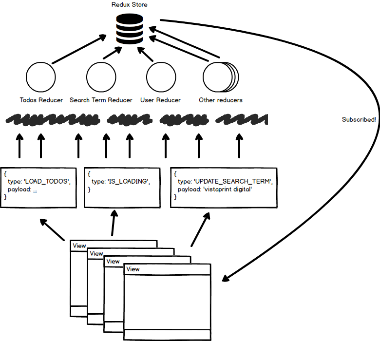

# Learning Redux

---

## About Eric

* @ericmasiello
* eric.j.masiello@gmail.com
* Fullstack JavaScript Engineer @ Vistaprint Digital
* Co-Instructor for FEWD 31
* Co-Author of Mastering React Native


---

## Agenda

1. Review: ES6, Promises, & React
2. Managing state w/o Redux
3. Redux: Actions, Reducers, and Middleware
4. Containers vs. Components
5. Refactoring with `react-redux`
6. Async Redux with `redux-thunk`
7. Selectors with `reselect`

---

## Review: ES6, Promises, & React

---

## Managing state w/o Redux

--

### React `state`

* `state` is often used as a data store for data
```js
  constructor(props) {
    super(props);
    this.state = {
      news: [],
      searchTerm: '',
    };
  }
```
* Often spread across multiple components, each with their own `state`

--

### Upsides to `state`

* Low barrier to entry
* Doesn't require any additional libraries

--

### Downsides to `state`

* Can't be used to server-side render React components
* No single source of truth (multiple component `state`s)
* Requires `React.createClass` or extending `React.Component`

Note:
* At scale, can be difficult to reason about

--

### Alternatives to `state`

* MobX https://github.com/mobxjs/mobx
* Redux http://redux.js.org/
* Reflux https://github.com/reflux/refluxjs
* Or any other one of the million flux libraries

--

### Why Redux

* Huge ecosystem of middleware
* Great documentation http://redux.js.org/
* De facto choice for React state management
* Well supported by other libraries/frameworks
* Supports React server side rendering

---


## Actions, Reducers, <del>and Middleware</del>

(We'll talk about middleware later on)

--

### A single source of truth

* The whole state of your app is stored in an object tree inside a single store.

```js
  {
    isLoading: false,
    news: [{}, {}, {}],
    searchTerm: 'general assembly',
    bookmarks: [733, 522, 28],
    userProfile: {
      firstName: 'Eric',
      lastName: 'Masiello',
      email: 'eric.j.masiello@gmail.com',
      jwt: 'xxxxx.yyyyy.zzzzz',      
    },
  }
``` 


\*"Ephemeral data" can still be stored in `state`

--

### Synchronous

* Redux only handles synchronous data flow
* Must apply middleware to work asynchronously (e.g. `redux-thunk`, `redux-promise`, `redux-saga`)

--

## Updating State

* Redux state is never mutated directly
* Changes are made via dispatched **actions**
* Actions have a `type` property

```js
store.dispatch({ type: 'IS_LOADING' });

store.dispatch({ type: 'DONE_LOADING' })

store.dispatch({ type: 'UPDATE_SEARCH_TERM', payload: 'gener' })

```

--

## Reducers

* Functions that decide how each action transforms the their respective piece of state
* Each reducer maps to exactly 1 part of your state tree object

```js
  {
    isLoading: loadingReducer,
    news: newsReducer,
    searchTerm: searchTermReducer,
    bookmarks: bookMarksReducer,
    userProfile: userProfileReducer,
  }
``` 
* Reducers receive two arguments: the *current state* and the *dispatched action*

--

## Reducers

* Reducers **return new state** for their respective piece of the state tree object

```js
function loadingReducer(state = false, action) {
  switch (action.type) {
  case 'IS_LOADING':
    return true;
  case 'DONE_LOADING':
    return false;
  default:
    return state;
  }
}

function searchTermReducer(state = '', action) {
  switch (action.type) {
  case 'UPDATE_SEARCH_TERM':
    return action.payload;
  default:
    return state;
  }
}
```
* **Note**: We are not changing state directly

--

### Creating a Redux store

```js
import { createStore, combineReducers, applyMiddleware } from 'redux';

const store = createStore(
  combineReducers({
    isLoading: loadingReducer,
    news: newsReducer,
    searchTerm: searchTermReducer,
    bookmarks: bookMarksReducer,
    userProfile: userProfileReducer,
  }),
  STATE_FROM_SERVER, // optional
  applyMiddleware(logger, thunk), // optional
);
```

--

## Listening for store updates

* `subscribe` method from store allows you to listen for store updates

```js
  constructor(props) {
    super(props);
    this.state = {
      isLoading: false,
      news: [],
      searchTerm: '',
      bookmarks: [],
      userProfile: {},
    };

    this.onStoreUpdate = this.onStoreUpdate.bind(this);
    store.subscribe(this.onStoreUpdate);
  }

  onStoreUpdate() {
    this.setState(store.getState());
  }
```

--

## Redux Data Flow



*Note:* This does not account for middleware

--

## Code Along

---

## Problem: We've added Redux, but we're still using `state`.

---

## Containers vs. Components

---

## Refactoring with `react-redux`

---

## Async Redux with `redux-thunk`

---

## Selectors with `reselect`

---

## Thank you!

